The effect of charr presence on stickleback phenotypes (linear traits)
================

This is an [R Markdown](http://rmarkdown.rstudio.com) Notebook for the analysis of arctic charr's effect on threespine stickleback morphology (linear traits).

First we prepare our libraries and working directory.

Read in landmark data from three sets of photographs: dorsal view, lateral view with open mouth, and lateral view with closed mouth. Most of the traits are measured from the lateral open mouth photographs, however some functional trait systems are characterized by measurements of traits from the multiple angles or positions.

``` r
# Data - Coordinates are saved in three different files (dorsal, closed, - open-mouthed)
Closed <- read.csv("GL19_Closed_Coord_Char.csv")
Open   <- read.csv("GL19_Open_Coord_Char.csv")
Dorsal   <- read.csv("GL19_Dorsal_Coord_Char.csv")
```

We create a function to measure linear distances for each trait (defined by the distance between two relevant landmarks) from the three photograph sets using the pythagorean theorem and then convert from pixels to mm using a size standard that was included in each photograph.

``` r
 distanceLM <- function(lm1,lm2) {
  X1 <- Xvalues[,lm1]
  X2 <- Xvalues[,lm2]
  Y1 <- Yvalues[,lm1]
  Y2 <- Yvalues[,lm2]
  distance1 <- sqrt((X1-X2)^2+(Y1-Y2)^2)/Traits$V2 
  return(distance1)
}  
```

First, we calculate the measurements of traits associated with foraging morphology from the dorsal photographs.

``` r
   str(Dorsal)
```

    ## 'data.frame':    757 obs. of  14 variables:
    ##  $ FishEc: int  185394 185395 185396 185397 185398 185399 185400 185401 185402 185403 ...
    ##  $ Lake  : Factor w/ 17 levels "Ak_008","Al_004",..: 1 1 1 1 1 1 1 1 1 1 ...
    ##  $ File  : Factor w/ 757 levels "Ak_008_dorsal_185394.JPG",..: 1 2 3 4 5 6 7 8 9 10 ...
    ##  $ V2    : num  74 74 74 74.5 74.3 75.1 74.4 74.2 74.7 74.3 ...
    ##  $ X1_x  : int  5234 4976 4811 4499 4451 4703 5608 4284 5796 5628 ...
    ##  $ X2_x  : int  5129 4875 4749 4457 4367 4637 5541 4241 5709 5568 ...
    ##  $ X3_x  : int  4269 3921 4116 3862 3523 4050 4568 3702 4717 4925 ...
    ##  $ X4_x  : int  4120 3755 3993 3747 3339 3918 4378 3629 4520 4827 ...
    ##  $ X5_x  : int  4089 3728 3975 3753 3342 3861 4390 3646 4484 4812 ...
    ##  $ X1_y  : int  2002 1654 1832 1891 2041 1947 1636 1901 1939 1734 ...
    ##  $ X2_y  : int  2006 1642 1834 1891 2041 1929 1636 1900 1924 1741 ...
    ##  $ X3_y  : int  1998 1579 1807 1896 2091 1809 1645 1985 1857 1668 ...
    ##  $ X4_y  : int  1802 1373 1669 1765 1882 1648 1396 1900 1619 1557 ...
    ##  $ X5_y  : int  2190 1820 1911 2013 2262 1911 1847 2105 2061 1807 ...

``` r
   Traits <- Dorsal[,c(1,2,4)]
   Xvalues <- Dorsal [,c(5:9)] # get all x values
   Yvalues <- Dorsal [,c(10:14)] # get all y values 
   
   Traits$EpaxWidth <- as.numeric(unlist(distanceLM(4,5)))  #Width of the epaxial muscle
   Dorsal_traits <- Traits[,c(1,4)] 
```

Then the open mouthed photographs.

``` r
str(Open)
```

    ## 'data.frame':    757 obs. of  42 variables:
    ##  $ FishEc: int  185394 185395 185396 185397 185398 185399 185400 185401 185402 185403 ...
    ##  $ Lake  : Factor w/ 16 levels "Ak_008","Al_004",..: 1 1 1 1 1 1 1 1 1 1 ...
    ##  $ V1    : Factor w/ 757 levels "Ak_008_lateral_o_185394.JPG",..: 1 2 3 4 5 6 7 8 9 10 ...
    ##  $ V2    : num  74 74.3 74 74 74 74.7 74.4 74 74.3 74.1 ...
    ##  $ X1_x  : int  5366 4954 4800 4500 4445 5176 4711 4288 4468 5620 ...
    ##  $ X2_x  : int  5412 4965 4859 4525 4433 5172 4763 4319 4480 5634 ...
    ##  $ X3_x  : int  5207 4818 4714 4428 4319 5077 4607 4236 4333 5530 ...
    ##  $ X4_x  : int  5099 4650 4622 4351 4171 4977 4435 4151 4156 5423 ...
    ##  $ X5_x  : int  5071 4627 4618 4341 4135 4954 4451 4152 4108 5418 ...
    ##  $ X6_x  : int  4331 3880 4037 3799 3404 4379 3614 3718 3362 4873 ...
    ##  $ X7_x  : int  4216 3777 3954 3736 3319 4295 3489 3651 3228 4811 ...
    ##  $ X8_x  : int  4213 3792 3925 3732 3331 4297 3496 3649 3262 4791 ...
    ##  $ X9_x  : int  3940 3446 3795 3550 3056 4093 3194 3490 2948 4593 ...
    ##  $ X10_x : int  3867 3406 3729 3492 3048 4089 3148 3468 3076 4534 ...
    ##  $ X11_x : int  3585 3100 3572 3339 2726 3829 2813 3296 2549 4358 ...
    ##  $ X12_x : int  3550 3068 3550 3314 2689 3807 2782 3277 2532 4337 ...
    ##  $ X13_x : int  3475 2949 3445 3213 2583 3719 2647 3210 2238 4240 ...
    ##  $ X14_x : int  3680 3104 3616 NA 2746 3909 2817 3258 2521 4406 ...
    ##  $ X15_x : int  3755 3133 3664 NA 2798 3944 2880 3312 2559 4472 ...
    ##  $ X16_x : int  3635 3027 3597 NA 2716 3849 2822 3235 2472 4409 ...
    ##  $ X17_x : int  3642 3034 3605 3372 2713 3844 2837 3254 2449 4427 ...
    ##  $ X18_x : int  3708 3072 3655 3413 2764 3900 2896 3282 2487 4453 ...
    ##  $ X19_x : int  3269 2552 3321 3107 2354 3609 2360 3033 1951 4195 ...
    ##  $ X1_y  : int  1907 1560 1715 1783 1869 1834 1628 1831 1678 1637 ...
    ##  $ X2_y  : int  2255 1908 1918 1972 2221 2073 1903 1974 2045 1834 ...
    ##  $ X3_y  : int  1926 1576 1730 1796 1877 1840 1646 1828 1668 1646 ...
    ##  $ X4_y  : int  2182 1835 1928 1964 2100 2072 1948 1969 1898 1807 ...
    ##  $ X5_y  : int  2262 1913 1982 2021 2176 2115 2023 2017 1994 1867 ...
    ##  $ X6_y  : int  1761 1251 1732 1759 1677 1818 1514 1787 1241 1538 ...
    ##  $ X7_y  : int  1719 1202 1703 1720 1638 1768 1470 1755 1213 1542 ...
    ##  $ X8_y  : int  1553 1019 1568 1616 1482 1614 1232 1676 1054 1443 ...
    ##  $ X9_y  : int  1554 980 1569 1622 1448 1604 1205 1650 1002 1463 ...
    ##  $ X10_y : int  1338 692 1379 1461 1237 1430 931 1516 794 1301 ...
    ##  $ X11_y : int  1551 960 1604 1637 1436 1615 1189 1642 927 1496 ...
    ##  $ X12_y : int  1556 964 1616 1656 1449 1623 1194 1648 950 1505 ...
    ##  $ X13_y : int  1330 645 1419 1502 1212 1440 913 1492 832 1305 ...
    ##  $ X14_y : int  2018 1456 1860 NA 1942 1986 1819 1903 1398 1793 ...
    ##  $ X15_y : int  2160 1656 1953 NA 2072 2078 1980 1975 1607 1870 ...
    ##  $ X16_y : int  2164 1651 1960 NA 2073 2081 1988 1974 1596 1883 ...
    ##  $ X17_y : int  2282 1786 2059 2046 2180 2209 2117 2101 1737 1977 ...
    ##  $ X18_y : int  2402 1896 2144 2105 2299 2290 2217 2175 1868 2054 ...
    ##  $ X19_y : int  2414 1865 2183 2140 2307 2297 2296 2175 1808 2114 ...

``` r
   Traits <- Open[,c(1,2,4)]
   Xvalues <- Open [,c(5:23)] # get all x values
   Yvalues <- Open [,c(24:42)] # get all y values 
   
   Traits$Gape <- as.numeric(unlist(distanceLM(1,2)))         
   Traits$Buccal_length <- as.numeric(unlist(distanceLM(1,6)))
   Traits$Neuro_Outlever <- as.numeric(unlist(distanceLM(1,7)))
   Traits$Jaw_Outlever <- as.numeric(unlist(distanceLM(4,2)))
   Traits$Jaw_Inlever <- as.numeric(unlist(distanceLM(4,5)))
   Traits$Epax_height_open <- as.numeric(unlist(distanceLM(8,7)))
   
   Open_traits <- Traits[,c(1,4:9)] 
```

Lastly, the closed mouth photos.

``` r
str(Closed)
```

    ## 'data.frame':    706 obs. of  55 variables:
    ##  $ FishEc : int  185394 185395 185396 185397 185398 185399 185400 185402 185403 185404 ...
    ##  $ Lake   : Factor w/ 16 levels "Ak_008","Al_004",..: 1 1 1 1 1 1 1 1 1 1 ...
    ##  $ Quality: Factor w/ 5 levels "h","m","p","t",..: 3 3 3 3 3 3 3 3 3 3 ...
    ##  $ V1     : Factor w/ 706 levels "Ak_008_lateral_c_185394.JPG",..: 1 2 3 4 5 6 7 8 9 10 ...
    ##  $ V2     : num  74.2 74.2 74.1 74.4 74.4 75.2 75 74.4 74.2 74.3 ...
    ##  $ X1_x   : int  4799 4698 4138 4123 5220 4166 4796 5050 5142 5449 ...
    ##  $ X2_x   : int  4553 4435 3917 3965 4954 3922 4531 4746 4943 5237 ...
    ##  $ X3_x   : int  4513 4391 3902 3947 4921 3922 4492 4699 4931 5197 ...
    ##  $ X4_x   : int  4415 4316 3877 3951 4930 3917 4437 4635 4935 5154 ...
    ##  $ X5_x   : int  4227 4104 3730 3807 4729 3772 4231 4417 4789 4961 ...
    ##  $ X6_x   : int  4067 3939 3599 3689 4569 3637 4037 4231 4685 4800 ...
    ##  $ X7_x   : int  3880 3719 3482 3565 4381 3480 3822 3992 4546 4669 ...
    ##  $ X8_x   : int  3803 3683 3446 3560 4284 3476 3795 3917 4477 4544 ...
    ##  $ X9_x   : int  3596 3423 3286 3406 4138 3306 3551 3731 4377 4437 ...
    ##  $ X10_x  : int  3605 3437 3291 3407 4135 3299 3559 3730 4378 4442 ...
    ##  $ X11_x  : int  3944 3795 3500 3579 4347 3449 3877 4045 4573 4682 ...
    ##  $ X12_x  : int  3910 3675 3466 3533 4383 3429 3796 4088 4535 4736 ...
    ##  $ X13_x  : int  3454 3103 3123 3226 3829 3096 3270 3399 4160 4302 ...
    ##  $ X14_x  : int  3155 2865 2934 3019 3552 2856 2909 3105 3966 4046 ...
    ##  $ X15_x  : int  3401 3144 3111 3221 3861 3094 3267 3397 4212 4239 ...
    ##  $ X16_x  : int  3326 3096 3127 3236 3842 3141 3251 3397 4148 4227 ...
    ##  $ X17_x  : int  2981 2750 2893 3036 3518 2885 2876 3027 3897 3938 ...
    ##  $ X18_x  : int  2426 2065 2512 2642 2850 2413 2226 2334 3459 3488 ...
    ##  $ X19_x  : int  2698 2367 2591 2700 3132 2548 2409 2576 3676 3683 ...
    ##  $ X20_x  : int  2138 1753 2418 2435 2668 2130 1681 1957 3324 3223 ...
    ##  $ X21_x  : int  1640 1218 2141 2150 2326 1842 1287 1426 3054 2881 ...
    ##  $ X22_x  : int  1828 1227 2117 2167 2252 1897 1359 1577 3069 2994 ...
    ##  $ X23_x  : int  1372 791 1769 1815 1813 1454 852 1053 2730 2656 ...
    ##  $ X24_x  : int  1274 725 1796 1825 1844 1490 844 971 2751 2565 ...
    ##  $ X25_x  : int  1243 637 1703 1744 1684 1381 711 885 2664 2530 ...
    ##  $ X1_y   : int  2030 1887 2020 2006 2031 1773 1814 2182 1659 1927 ...
    ##  $ X2_y   : int  2293 2133 2125 2124 2199 1850 2046 2408 1759 2126 ...
    ##  $ X3_y   : int  2234 2083 2082 2081 2129 1798 1980 2343 1713 2070 ...
    ##  $ X4_y   : int  1961 1816 1902 1918 1839 1599 1709 2029 1536 1817 ...
    ##  $ X5_y   : int  1794 1607 1752 1755 1648 1439 1484 1794 1375 1689 ...
    ##  $ X6_y   : int  1936 1776 1868 1845 1731 1528 1623 1896 1460 1798 ...
    ##  $ X7_y   : int  2040 1861 1904 1881 1766 1546 1718 1982 1503 1823 ...
    ##  $ X8_y   : int  1746 1449 1674 1651 1529 1277 1334 1676 1312 1622 ...
    ##  $ X9_y   : int  1721 1400 1654 1613 1498 1241 1273 1642 1299 1617 ...
    ##  $ X10_y  : int  1906 1658 1780 1735 1628 1378 1500 1793 1395 1724 ...
    ##  $ X11_y  : int  2418 2254 2135 2112 2140 1810 2091 2418 1737 2134 ...
    ##  $ X12_y  : int  2473 2263 2163 2126 2233 1828 2138 2518 1788 2232 ...
    ##  $ X13_y  : int  2581 2339 2207 2109 2294 1861 2197 2601 1836 2363 ...
    ##  $ X14_y  : int  2626 2330 2178 2061 2310 1835 2234 2580 1853 2363 ...
    ##  $ X15_y  : int  2168 1900 1929 1851 1854 1531 1740 2097 1553 1981 ...
    ##  $ X16_y  : int  1746 1391 1636 1585 1476 1194 1233 1654 1302 1629 ...
    ##  $ X17_y  : int  1811 1412 1656 1575 1465 1176 1229 1670 1320 1659 ...
    ##  $ X18_y  : int  1890 1496 1724 1575 1585 1165 1217 1729 1400 1722 ...
    ##  $ X19_y  : int  2656 2356 2193 2046 2373 1817 2297 2637 1907 2396 ...
    ##  $ X20_y  : int  2493 2226 2104 1926 2191 1575 1809 2382 1766 2171 ...
    ##  $ X21_y  : int  2166 1966 2072 1809 2130 1464 1541 2100 1744 1919 ...
    ##  $ X22_y  : int  1967 1693 1882 1636 1882 1249 1249 1849 1564 1732 ...
    ##  $ X23_y  : int  1778 1561 2007 1680 2081 1389 1255 1692 1742 1532 ...
    ##  $ X24_y  : int  1903 1729 2113 1773 2253 1503 1440 1829 1811 1639 ...
    ##  $ X25_y  : int  1781 1584 2079 1730 2191 1471 1339 1678 1802 1514 ...

``` r
   Traits <- Closed[,c(1,2,3,5)]
   Xvalues <- Closed [,c(6:30)] # get all x values
   Yvalues <- Closed [,c(31:55)] # get all y values 
   
   Traits$StLen <- as.numeric(unlist(distanceLM(1,25)))  #standard length of fish
   Traits$Epax_height_closed <- as.numeric(unlist(distanceLM(9,10)))
   Traits$Coupler <- as.numeric(unlist(distanceLM(2,11)))
   Traits$Fixed <- as.numeric(unlist(distanceLM(3,7)))
   Traits$Input <- as.numeric(unlist(distanceLM(7,11)))
   Traits$Output <- as.numeric(unlist(distanceLM(2,3)))
   Traits$Diagonal <- as.numeric(unlist(distanceLM(3,11)))
   Traits$BodyDepth <- as.numeric(unlist(distanceLM(13,16)))
   Traits$HeadLen <- as.numeric(unlist(distanceLM(1,7)))  #length of the head
   Traits$EyeDiam <- as.numeric(unlist(distanceLM(4,6)))  

   
   Closed_traits <- Traits[,c(1,3,5:14)] 
```

Now we calculate measurements of other traits that will not go into calculation of functional systems from landmarks on the open mouthed photos.

``` r
   str(Open)
```

    ## 'data.frame':    757 obs. of  42 variables:
    ##  $ FishEc: int  185394 185395 185396 185397 185398 185399 185400 185401 185402 185403 ...
    ##  $ Lake  : Factor w/ 16 levels "Ak_008","Al_004",..: 1 1 1 1 1 1 1 1 1 1 ...
    ##  $ V1    : Factor w/ 757 levels "Ak_008_lateral_o_185394.JPG",..: 1 2 3 4 5 6 7 8 9 10 ...
    ##  $ V2    : num  74 74.3 74 74 74 74.7 74.4 74 74.3 74.1 ...
    ##  $ X1_x  : int  5366 4954 4800 4500 4445 5176 4711 4288 4468 5620 ...
    ##  $ X2_x  : int  5412 4965 4859 4525 4433 5172 4763 4319 4480 5634 ...
    ##  $ X3_x  : int  5207 4818 4714 4428 4319 5077 4607 4236 4333 5530 ...
    ##  $ X4_x  : int  5099 4650 4622 4351 4171 4977 4435 4151 4156 5423 ...
    ##  $ X5_x  : int  5071 4627 4618 4341 4135 4954 4451 4152 4108 5418 ...
    ##  $ X6_x  : int  4331 3880 4037 3799 3404 4379 3614 3718 3362 4873 ...
    ##  $ X7_x  : int  4216 3777 3954 3736 3319 4295 3489 3651 3228 4811 ...
    ##  $ X8_x  : int  4213 3792 3925 3732 3331 4297 3496 3649 3262 4791 ...
    ##  $ X9_x  : int  3940 3446 3795 3550 3056 4093 3194 3490 2948 4593 ...
    ##  $ X10_x : int  3867 3406 3729 3492 3048 4089 3148 3468 3076 4534 ...
    ##  $ X11_x : int  3585 3100 3572 3339 2726 3829 2813 3296 2549 4358 ...
    ##  $ X12_x : int  3550 3068 3550 3314 2689 3807 2782 3277 2532 4337 ...
    ##  $ X13_x : int  3475 2949 3445 3213 2583 3719 2647 3210 2238 4240 ...
    ##  $ X14_x : int  3680 3104 3616 NA 2746 3909 2817 3258 2521 4406 ...
    ##  $ X15_x : int  3755 3133 3664 NA 2798 3944 2880 3312 2559 4472 ...
    ##  $ X16_x : int  3635 3027 3597 NA 2716 3849 2822 3235 2472 4409 ...
    ##  $ X17_x : int  3642 3034 3605 3372 2713 3844 2837 3254 2449 4427 ...
    ##  $ X18_x : int  3708 3072 3655 3413 2764 3900 2896 3282 2487 4453 ...
    ##  $ X19_x : int  3269 2552 3321 3107 2354 3609 2360 3033 1951 4195 ...
    ##  $ X1_y  : int  1907 1560 1715 1783 1869 1834 1628 1831 1678 1637 ...
    ##  $ X2_y  : int  2255 1908 1918 1972 2221 2073 1903 1974 2045 1834 ...
    ##  $ X3_y  : int  1926 1576 1730 1796 1877 1840 1646 1828 1668 1646 ...
    ##  $ X4_y  : int  2182 1835 1928 1964 2100 2072 1948 1969 1898 1807 ...
    ##  $ X5_y  : int  2262 1913 1982 2021 2176 2115 2023 2017 1994 1867 ...
    ##  $ X6_y  : int  1761 1251 1732 1759 1677 1818 1514 1787 1241 1538 ...
    ##  $ X7_y  : int  1719 1202 1703 1720 1638 1768 1470 1755 1213 1542 ...
    ##  $ X8_y  : int  1553 1019 1568 1616 1482 1614 1232 1676 1054 1443 ...
    ##  $ X9_y  : int  1554 980 1569 1622 1448 1604 1205 1650 1002 1463 ...
    ##  $ X10_y : int  1338 692 1379 1461 1237 1430 931 1516 794 1301 ...
    ##  $ X11_y : int  1551 960 1604 1637 1436 1615 1189 1642 927 1496 ...
    ##  $ X12_y : int  1556 964 1616 1656 1449 1623 1194 1648 950 1505 ...
    ##  $ X13_y : int  1330 645 1419 1502 1212 1440 913 1492 832 1305 ...
    ##  $ X14_y : int  2018 1456 1860 NA 1942 1986 1819 1903 1398 1793 ...
    ##  $ X15_y : int  2160 1656 1953 NA 2072 2078 1980 1975 1607 1870 ...
    ##  $ X16_y : int  2164 1651 1960 NA 2073 2081 1988 1974 1596 1883 ...
    ##  $ X17_y : int  2282 1786 2059 2046 2180 2209 2117 2101 1737 1977 ...
    ##  $ X18_y : int  2402 1896 2144 2105 2299 2290 2217 2175 1868 2054 ...
    ##  $ X19_y : int  2414 1865 2183 2140 2307 2297 2296 2175 1808 2114 ...

``` r
   Traits <- Open[,c(1,2,4)]
   Xvalues <- Open [,c(5:23)] # get all x values
   Yvalues <- Open [,c(24:42)] # get all y values 
   
   Traits$Jaw_prot <- as.numeric(unlist(distanceLM(1,3)))
   Traits$Spine1_L <- as.numeric(unlist(distanceLM(9,10)))
   Traits$Spine2_L <- as.numeric(unlist(distanceLM(11,13)))
   Traits$Spine2_W <- as.numeric(unlist(distanceLM(11,12)))
   Traits$PelvSpine_L <- as.numeric(unlist(distanceLM(17,19)))
   Traits$PelvSpine_W <- as.numeric(unlist(distanceLM(17,18)))
   Traits$AscProc_W <- as.numeric(unlist(distanceLM(15,16)))
   Traits$AscProc_L <- as.numeric(unlist(distanceLM(14,18)))
   
   Other_traits <- Traits[,c(1,4:11)] 
```

Now that we've got each set of linear trait measurements (in mm thanks to our function), we can combine them all into a single data frame based on the specimen ID number.

``` r
   Linear_traits <- Closed_traits %>% 
   left_join(Open_traits, by = "FishEc", all=T) %>% 
   left_join(Dorsal_traits, by = "FishEc", all=T) %>% 
   left_join(Other_traits, by = "FishEc", all=T)
```

Read in a file that contains the source location for each sample and add this to our trait data frame.

``` r
   Fish_info <- read_csv("Fishec_Fish_2019.csv")
```

    ## 
    ## ── Column specification ────────────────────────────────────────────────────────
    ## cols(
    ##   Site = col_character(),
    ##   FishEc = col_double(),
    ##   SL = col_double(),
    ##   Parasites = col_double(),
    ##   Remarks_lab = col_character(),
    ##   Remarks_field = col_character(),
    ##   Type = col_character()
    ## )

``` r
   All_traits <- Fish_info %>% 
     filter(Type == "Fish") %>%
     select(Site, FishEc) %>% 
     right_join(Linear_traits, by = "FishEc", all=T)
```

Retain only specimens with a standard length greater than 25 mm, as smaller individuals are either juveniles or heavily warped specimens. Also remove specimens with missing measurements

``` r
All_traits <- All_traits %>% 
     filter(StLen >= 25)

All_traits <- na.omit(All_traits)
```

Inspect the relationship between standard length and each of our traits (log transformed for normality) to determine if size standardization is required.

``` r
   All_traits %>% 
     filter(Quality != "b") %>% 
     pivot_longer(cols = "Epax_height_closed":"AscProc_L" ,  names_to = "Trait", values_to = "Trait_value" ) %>% 
     ggplot(aes(x=(log10(StLen)), y=(log10(Trait_value)), color=Site, label = FishEc))+
     geom_point()+
     geom_smooth(method = "lm", se=F)+
     facet_wrap(~Trait, scales = "free")
```

    ## `geom_smooth()` using formula 'y ~ x'

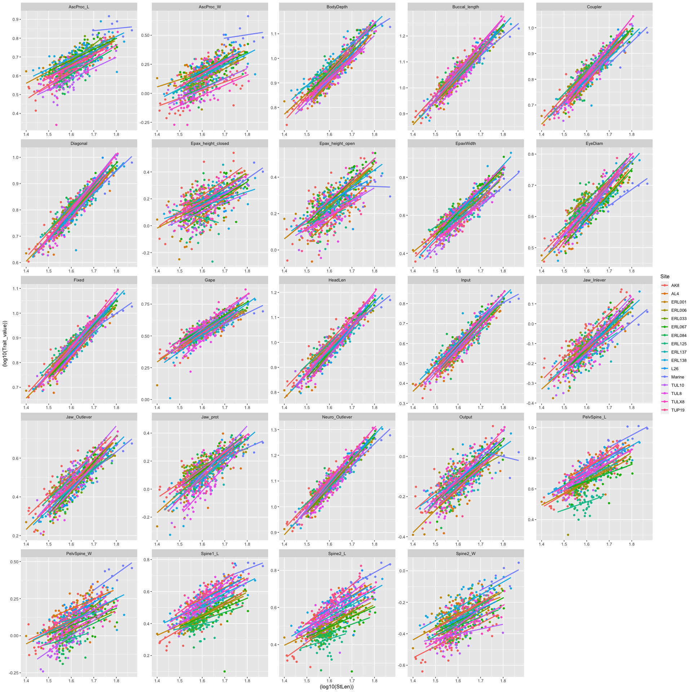

All traits clearly covary with standard length, so we need to size standardize the linear measurements that do not go into calculating functional systems (functional systems are measured as ratios, so size standardization is not required). We will standardize each of these measurement to a common standard body length within each population (because while the overall slopes of the relationship between traits and SL look similar across populations, the intercepts differ a bit) using the below code.

``` r
     traits <- data.matrix(All_traits[,c(11:13,21:28)])
     L <- as.vector(colnames(traits))
     O = lapply(L, function(column)  {
       All_traitsI <- All_traits[,c("StLen","Site")]
       All_traitsI$trait <- traits[,column ]
       Model <- lm(log10(trait)~log10(StLen)+Site, data=All_traitsI)
       All_traitsI$Resid <- residuals(Model)
       Standard_size <- data.frame(StLen=c(45,45,45,45,45,45,45,45,45,45,45,45,45,45,45,45), 
                                   Site = c("AK8","AL4","ERL001","ERL125","ERL137","ERL138","ERL033",
                                            "ERL006","ERL067","ERL084","L26","TUL10","TUL8","TULX8","TUP19","Marine"))   # This dataframe helps to find the estimated trait values for some arbitrary standardized size
       Standard_size$Mean_pred_trait<- predict(Model, newdata=Standard_size)
       All_traitsI <- right_join(All_traitsI, Standard_size[,2:3], by = "Site")
       trait_cor <- as.data.frame(10^(All_traitsI$Mean_pred_trait + All_traitsI$Resid))
       colnames(trait_cor) <- paste(column, "cor", sep = "_")
       return(trait_cor)})
     Traits_cor <- do.call(cbind, O)
```

Now we create a reduced data frame with our newly size corrected traits and the original traits for the functional systems we will calculate later.

``` r
 SizeCorrected_Traits <- cbind(All_traits[c(1:2,4)], Traits_cor)
```

Using the remaining unstandardized linear traits, we will calculate a set of composite traits representing functional trait systems involved with foraging in fishes.

``` r
##Suction Index
     CSA = (pi*(All_traits$Epax_height_open*All_traits$EpaxWidth/2)/2) 
     SizeCorrected_Traits$Suction_index = (CSA*(All_traits$Epax_height_open/All_traits$Neuro_Outlever))/(All_traits$Gape*All_traits$Buccal_length)
    
     
##Four-bar linkage
     Oin_start <-  acos((All_traits$Fixed^2+All_traits$Input^2-All_traits$Diagonal^2)/(2*All_traits$Fixed*All_traits$Input))
     O1_start  <-  acos((All_traits$Fixed^2 + All_traits$Diagonal^2 - All_traits$Input^2)/(2*All_traits$Fixed*All_traits$Diagonal))
     O2_start  <-  acos((All_traits$Output^2 + All_traits$Diagonal^2 - All_traits$Coupler^2)/(2*All_traits$Output*All_traits$Diagonal))
     out_start <-  O1_start+O2_start 
     Oin_end <- Oin_start + ((2*pi*5)/360)
     Dend <- sqrt(All_traits$Input^2+All_traits$Fixed^2-2*All_traits$Input*All_traits$Fixed*cos(Oin_end))
     O1_end  <-  acos((All_traits$Fixed^2 + Dend^2 - All_traits$Input^2)/(2*All_traits$Fixed*Dend))
     O2_end  <-  acos((All_traits$Output^2 + Dend^2 - All_traits$Coupler^2)/(2*All_traits$Output*Dend))
```

    ## Warning in acos((All_traits$Output^2 + Dend^2 - All_traits$Coupler^2)/(2 * :
    ## NaNs produced

``` r
     out_end <-  O1_end+O2_end
     SizeCorrected_Traits$KT <- abs(out_start-out_end)/(((2*pi*5)/360))
     
     
##Displacement advantage
     SizeCorrected_Traits$Disp_adv = All_traits$Jaw_Outlever/All_traits$Jaw_Inlever 
```

Log transform our final trait set

``` r
     cols <- c(names(SizeCorrected_Traits[c(3:17)]))
     
     setDT(SizeCorrected_Traits)[, paste0("log_", cols) := lapply(.SD, log10), .SDcols = cols]
     
     FinalTraits <- SizeCorrected_Traits[,c(1:2,18:32)]
```

Now we have our data ready for analysis. Let's look at how many specimens we have remaining for each sampling location.

``` r
FinalTraits %>% group_by(Site) %>% tally()
```

    ## # A tibble: 16 × 2
    ##    Site       n
    ##    <chr>  <int>
    ##  1 AK8       46
    ##  2 AL4       47
    ##  3 ERL001    46
    ##  4 ERL006    50
    ##  5 ERL033    40
    ##  6 ERL067    49
    ##  7 ERL084    48
    ##  8 ERL125    40
    ##  9 ERL137    46
    ## 10 ERL138    46
    ## 11 L26       46
    ## 12 Marine     9
    ## 13 TUL10     46
    ## 14 TUL8      49
    ## 15 TULX8     45
    ## 16 TUP19     45

Use PCA to look for overall patterns of trait covariation across freshwater populations.

``` r
Data <- as.data.frame(na.omit(FinalTraits)) #PCA won't work with missing data, so we remove an individual where one of the functional systems could not be calculated from the photographs

Data<-Data[!(Data$Site=="Marine"),] #remove the marine population

pca<-prcomp(Data[,c(4:17)])
summary(pca) # print variance accounted for by each axis
```

    ## Importance of components:
    ##                           PC1    PC2     PC3     PC4     PC5     PC6     PC7
    ## Standard deviation     0.1522 0.1326 0.09491 0.08066 0.07179 0.05713 0.05314
    ## Proportion of Variance 0.3111 0.2362 0.12097 0.08737 0.06920 0.04383 0.03793
    ## Cumulative Proportion  0.3111 0.5472 0.66821 0.75557 0.82478 0.86860 0.90653
    ##                            PC8     PC9    PC10    PC11    PC12    PC13    PC14
    ## Standard deviation     0.04678 0.03736 0.03499 0.03066 0.02284 0.02114 0.01558
    ## Proportion of Variance 0.02939 0.01875 0.01644 0.01262 0.00700 0.00600 0.00326
    ## Cumulative Proportion  0.93592 0.95467 0.97111 0.98373 0.99074 0.99674 1.00000

Let's take a look at what traits load highly onto each axis.

``` r
pca$rotation 
```

    ##                              PC1         PC2          PC3         PC4
    ## log_BodyDepth_cor   -0.065742323  0.02259743 -0.035517588  0.11219468
    ## log_HeadLen_cor      0.020447230  0.05502985 -0.005581841  0.14685248
    ## log_EyeDiam_cor      0.028017239  0.07438972  0.019805943  0.12722950
    ## log_Jaw_prot_cor     0.026644737  0.13878164 -0.149163516  0.81120329
    ## log_Spine1_L_cor     0.070986485 -0.40480923  0.342102161  0.06045168
    ## log_Spine2_L_cor     0.066240681 -0.38630233  0.339862589  0.06514794
    ## log_Spine2_W_cor    -0.012803802 -0.25816349 -0.280271922  0.41857909
    ## log_PelvSpine_L_cor  0.040765194 -0.36620220  0.355426799  0.10321683
    ## log_PelvSpine_W_cor  0.008749649 -0.46308680  0.004703124  0.09793810
    ## log_AscProc_W_cor   -0.006362649 -0.45873070 -0.697940102 -0.24545226
    ## log_AscProc_L_cor   -0.077101476 -0.16162493 -0.171417239  0.04453064
    ## log_Suction_index   -0.986444642 -0.04635713  0.084776972  0.03505722
    ## log_KT              -0.045889801 -0.06745265 -0.101715497 -0.04190378
    ## log_Disp_adv         0.035661193  0.01047637 -0.067710668  0.15179310
    ##                              PC5         PC6         PC7         PC8
    ## log_BodyDepth_cor   -0.020344975  0.04539895 -0.07643284  0.12120807
    ## log_HeadLen_cor     -0.080592812 -0.02664802 -0.01512687 -0.03295346
    ## log_EyeDiam_cor     -0.054189425 -0.01425213  0.02628831  0.06469206
    ## log_Jaw_prot_cor    -0.376552278 -0.20148554  0.09122391  0.19213328
    ## log_Spine1_L_cor     0.084457953 -0.26133836  0.09457375  0.13162614
    ## log_Spine2_L_cor     0.109658483 -0.21935483  0.03949445  0.10160475
    ## log_Spine2_W_cor     0.737828347  0.31309959  0.13508532 -0.07827631
    ## log_PelvSpine_L_cor -0.095667627 -0.06469278  0.07582949  0.09196690
    ## log_PelvSpine_W_cor -0.429730641  0.49817759 -0.30975761 -0.38153638
    ## log_AscProc_W_cor   -0.180444037 -0.36637229  0.23052952  0.06764794
    ## log_AscProc_L_cor   -0.116325243  0.26424799 -0.15553853  0.16978543
    ## log_Suction_index   -0.006347739 -0.08038369  0.04189976 -0.04731551
    ## log_KT               0.138865607 -0.04747397 -0.71978815  0.60084411
    ## log_Disp_adv         0.159930265 -0.52616215 -0.50722552 -0.59888448
    ##                             PC9         PC10        PC11          PC12
    ## log_BodyDepth_cor   -0.30415718  0.200684925 -0.38639080  0.0510685303
    ## log_HeadLen_cor     -0.19649284  0.080503629 -0.46925111  0.1618989889
    ## log_EyeDiam_cor     -0.11585342  0.191042963 -0.59404025  0.0146021655
    ## log_Jaw_prot_cor     0.09587179 -0.151480985  0.19502895 -0.0183723003
    ## log_Spine1_L_cor    -0.29989176 -0.244459856 -0.08687497 -0.6693729050
    ## log_Spine2_L_cor    -0.22528107 -0.257032200  0.08470647  0.7202550219
    ## log_Spine2_W_cor     0.09751260  0.008744763 -0.04505255 -0.0152752907
    ## log_PelvSpine_L_cor  0.46454656  0.689046865  0.03459517  0.0003662516
    ## log_PelvSpine_W_cor  0.11360369 -0.256689064 -0.13811009 -0.0193764156
    ## log_AscProc_W_cor    0.06835278  0.018226940 -0.10446373  0.0398658984
    ## log_AscProc_L_cor   -0.63151498  0.420494395  0.42411349 -0.0219343576
    ## log_Suction_index    0.03252243 -0.039960956 -0.02159861  0.0011673288
    ## log_KT               0.23416291 -0.115985858 -0.07658809 -0.0147843879
    ## log_Disp_adv        -0.08937372  0.187152259  0.07378945 -0.0300551923
    ##                             PC13         PC14
    ## log_BodyDepth_cor    0.782551488  0.247449185
    ## log_HeadLen_cor     -0.099513119 -0.815497226
    ## log_EyeDiam_cor     -0.569081035  0.492154584
    ## log_Jaw_prot_cor     0.018660791  0.035273067
    ## log_Spine1_L_cor    -0.003969850 -0.058161791
    ## log_Spine2_L_cor    -0.033108983  0.103687922
    ## log_Spine2_W_cor    -0.019176074 -0.020338686
    ## log_PelvSpine_L_cor  0.053224461 -0.071329241
    ## log_PelvSpine_W_cor  0.014695063  0.055046290
    ## log_AscProc_W_cor    0.011195898  0.004245307
    ## log_AscProc_L_cor   -0.207461657 -0.034170050
    ## log_Suction_index   -0.051291378 -0.010602260
    ## log_KT              -0.056046756 -0.055549097
    ## log_Disp_adv        -0.006530849  0.056776139

``` r
loads <-with(pca, unclass(rotation))
```

Now let's see how many PC axes are needed to explain the majority of trait variation (based either on &gt;90% variance explained or eigenvalues &gt;1).

``` r
plot(pca,type="lines") # scree plot
```

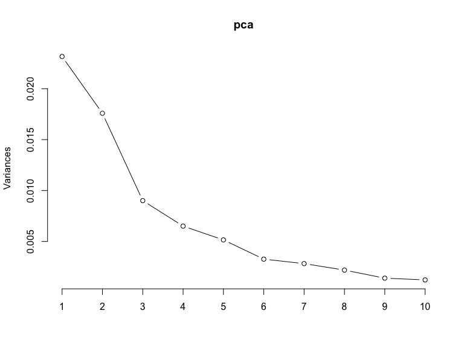

``` r
pr.cvar <- pca$sdev ^ 2 # Calculate eigen value for each component
round(pr.cvar, 4) # Eigen values 
```

    ##  [1] 0.0232 0.0176 0.0090 0.0065 0.0052 0.0033 0.0028 0.0022 0.0014 0.0012
    ## [11] 0.0009 0.0005 0.0004 0.0002

``` r
mean(pr.cvar)
```

    ## [1] 0.005318914

``` r
pve_cov <- pr.cvar/sum(pr.cvar) # Variance explained by each principal component: pve
pve_cov
```

    ##  [1] 0.311058398 0.236173645 0.120973403 0.087367664 0.069202915 0.043828585
    ##  [7] 0.037927865 0.029391560 0.018745859 0.016444086 0.012620205 0.007003590
    ## [13] 0.006002219 0.003260006

Add PC scores to our data sheet.

``` r
scores <- pca$x
scores <- data.frame(scores)
Data <- cbind(Data, scores)
names(Data)
```

    ##  [1] "Site"                "FishEc"              "log_StLen"          
    ##  [4] "log_BodyDepth_cor"   "log_HeadLen_cor"     "log_EyeDiam_cor"    
    ##  [7] "log_Jaw_prot_cor"    "log_Spine1_L_cor"    "log_Spine2_L_cor"   
    ## [10] "log_Spine2_W_cor"    "log_PelvSpine_L_cor" "log_PelvSpine_W_cor"
    ## [13] "log_AscProc_W_cor"   "log_AscProc_L_cor"   "log_Suction_index"  
    ## [16] "log_KT"              "log_Disp_adv"        "PC1"                
    ## [19] "PC2"                 "PC3"                 "PC4"                
    ## [22] "PC5"                 "PC6"                 "PC7"                
    ## [25] "PC8"                 "PC9"                 "PC10"               
    ## [28] "PC11"                "PC12"                "PC13"               
    ## [31] "PC14"

Load in environmental information for each site and add this to our data sheet.

``` r
LakeInfo <- read.csv("GL_Lake_Master.csv")
LakeInfo<-LakeInfo[(LakeInfo$Year=="2019"),] #data for sampling year
LakeInfo <- LakeInfo[, c(2,11,12,14)] #subset to relevant info
Data   <- merge(LakeInfo, Data, by.x = ("Lake"), by.y = ("Site"), all.y = TRUE)
colnames(Data)[1] <- "Site"
#write.csv(Data, "LinearTraitPCScores.csv")
```

Now that we have all of our relevant information in one place, we plot the PCA results for all individuals, colored by habitat type.

``` r
ggplot(Data, aes(PC1, PC2, shape=Fish, color=Fish, size=Areaha)) + geom_point() + 
  theme_classic() + scale_color_manual(values=c( "#016450", "#67a9cf")) 
```

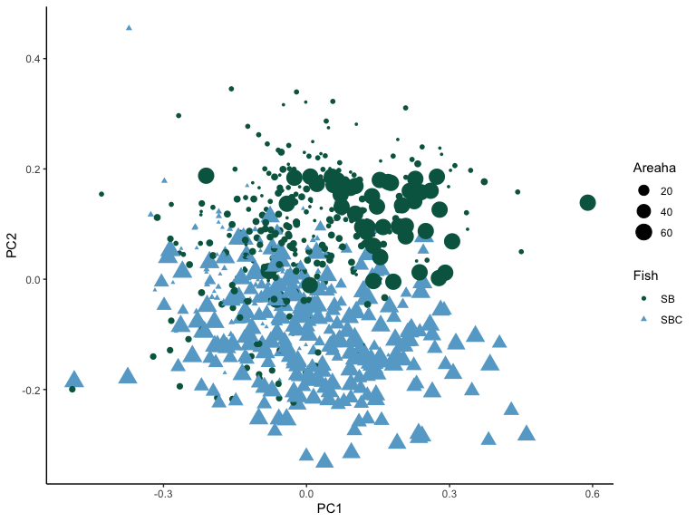

That's a bit too messy to see anything beyond the overal patter of some separation by habitat characteristics along PC1. Let's calculate population averages for these two PCs and replot the data.

``` r
gd <- Data %>% 
  dplyr::group_by(Site) %>% # Group the data by sample site
  dplyr::summarize(mean_Comp1=mean(PC1), # Create variable with mean of PC per group
            mean_Comp2=mean(PC2),
            mean_Comp3=mean(PC3),
            mean_Comp4=mean(PC4),
            sd_Comp.1=sd(PC1), # Create variable with sd of PC per group
            sd_Comp.2=sd(PC2),
            sd_Comp.3=sd(PC3),
            sd_Comp.4=sd(PC4),
            N_PC=n(), # Create new variable N of PC per group
            se1=sd_Comp.1/sqrt(N_PC), # Create variable with se of PC per group
            se2=sd_Comp.2/sqrt(N_PC), 
            se3=sd_Comp.3/sqrt(N_PC),
            se4=sd_Comp.4/sqrt(N_PC),
            upper_limit1=mean_Comp1+se1, # Upper limit
            lower_limit1=mean_Comp1-se1, # Lower limit
            upper_limit2=mean_Comp2+se2, # Upper limit
            lower_limit2=mean_Comp2-se2, # Lower limit
            upper_limit3=mean_Comp3+se3, # Upper limit
            lower_limit3=mean_Comp3-se3, # Lower limit
            upper_limit4=mean_Comp4+se4, # Upper limit
            lower_limit4=mean_Comp4-se4 # Lower limit
  ) 

gd   <- merge(LakeInfo, gd, by.x = ("Lake"), by.y = ("Site"), all.y = TRUE)
colnames(gd)[5] <- "PC1"
colnames(gd)[6] <- "PC2"
colnames(gd)[7] <- "PC3"
colnames(gd)[8] <- "PC4"


gd
```

    ##      Lake Fish Areaha Altitude         PC1          PC2          PC3
    ## 1     AK8   SB   3.60     25.3 -0.03593428  0.110224470  0.059142287
    ## 2     AL4  SBC  42.80     14.3  0.09792138 -0.169271823 -0.007805303
    ## 3  ERL001  SBC  51.80    139.0 -0.07687079 -0.030033643 -0.083292884
    ## 4  ERL006   SB   7.20     92.7 -0.01141446  0.079247595 -0.043397493
    ## 5  ERL033  SBC   2.50    119.5 -0.10472687 -0.002328111 -0.051222614
    ## 6  ERL067  SBC   3.20     99.4 -0.10922406  0.032655275 -0.085304708
    ## 7  ERL084   SB   2.50    149.4  0.03447720  0.145643051  0.017932995
    ## 8  ERL125   SB   3.70     52.4  0.07059549  0.175844833 -0.136101844
    ## 9  ERL137  SBC  13.40      5.5  0.01557545 -0.040085668 -0.023743760
    ## 10 ERL138   SB   6.02     18.3 -0.09993977 -0.089333995  0.003107589
    ## 11    L26  SBC  26.30    123.7 -0.05838756 -0.136348713  0.013601469
    ## 12  TUL10   SB  64.50     49.7  0.14459360  0.113554840  0.087303791
    ## 13   TUL8  SBC  48.10     12.8  0.02145916 -0.097825724  0.046673837
    ## 14  TULX8   SB   7.30     36.3 -0.01843447  0.078065628  0.149002901
    ## 15  TUP19  SBC  28.60      4.0  0.13297130 -0.150418916  0.036425514
    ##             PC4 sd_Comp.1  sd_Comp.2  sd_Comp.3  sd_Comp.4 N_PC        se1
    ## 1   0.032589639 0.1704574 0.08555327 0.08566593 0.07824156   46 0.02513257
    ## 2  -0.004398692 0.1311943 0.07765793 0.06212173 0.08042988   47 0.01913665
    ## 3   0.007723244 0.1495679 0.07257608 0.04973336 0.07089095   46 0.02205258
    ## 4   0.071400985 0.1209132 0.04792584 0.05910259 0.06425011   50 0.01709971
    ## 5  -0.015574676 0.1073108 0.08337125 0.06542272 0.06627109   40 0.01696732
    ## 6  -0.010828852 0.1082672 0.09225834 0.06615080 0.05901179   49 0.01546674
    ## 7   0.028471903 0.1347161 0.08487213 0.06280020 0.07152189   48 0.01944460
    ## 8  -0.048669506 0.1400546 0.08079783 0.06384872 0.06060357   39 0.02242669
    ## 9  -0.029272698 0.1094165 0.05901957 0.06163186 0.06658794   46 0.01613259
    ## 10  0.030495153 0.1201986 0.09460739 0.06857105 0.07850086   46 0.01772232
    ## 11  0.010674799 0.1370531 0.07518219 0.07419875 0.05973306   46 0.02020737
    ## 12 -0.033323389 0.1293021 0.06592356 0.06192518 0.08514014   46 0.01906455
    ## 13 -0.101329811 0.1449253 0.06851067 0.06225173 0.07056974   49 0.02070361
    ## 14  0.048453684 0.1057843 0.07408907 0.06515987 0.05843929   45 0.01576940
    ## 15  0.005282311 0.1268215 0.06653486 0.06361667 0.06639973   45 0.01890543
    ##            se2         se3         se4 upper_limit1  lower_limit1 upper_limit2
    ## 1  0.012614141 0.012630753 0.011536089 -0.010801703 -0.0610668528   0.12283861
    ## 2  0.011327574 0.009061386 0.011731903  0.117058028  0.0787847292  -0.15794425
    ## 3  0.010700760 0.007332785 0.010452300 -0.054818208 -0.0989233646  -0.01933288
    ## 4  0.006777737 0.008358369 0.009086337  0.005685254 -0.0285141715   0.08602533
    ## 5  0.013182152 0.010344241 0.010478380 -0.087759554 -0.1216941953   0.01085404
    ## 6  0.013179763 0.009450114 0.008430255 -0.093757317 -0.1246907999   0.04583504
    ## 7  0.012250236 0.009064428 0.010323296  0.053921802  0.0150326066   0.15789329
    ## 8  0.012938007 0.010223978 0.009704338  0.093022177  0.0481687932   0.18878284
    ## 9  0.008701960 0.009087121 0.009817856  0.031708036 -0.0005571412  -0.03138371
    ## 10 0.013949099 0.010110250 0.011574320 -0.082217449 -0.1176620832  -0.07538490
    ## 11 0.011085010 0.010940009 0.008807159 -0.038180187 -0.0785949318  -0.12526370
    ## 12 0.009719899 0.009130370 0.012553229  0.163658146  0.1255290465   0.12327474
    ## 13 0.009787239 0.008893104 0.010081391  0.042162765  0.0007555484  -0.08803849
    ## 14 0.011044547 0.009713460 0.008711615 -0.002665072 -0.0342038683   0.08911017
    ## 15 0.009918431 0.009483414 0.009898287  0.151876730  0.1140658785  -0.14050049
    ##    lower_limit2 upper_limit3 lower_limit3 upper_limit4 lower_limit4
    ## 1    0.09761033  0.071773039  0.046511534  0.044125728  0.021053550
    ## 2   -0.18059940  0.001256083 -0.016866689  0.007333211 -0.016130596
    ## 3   -0.04073440 -0.075960099 -0.090625668  0.018175545 -0.002729056
    ## 4    0.07246986 -0.035039124 -0.051755861  0.080487322  0.062314647
    ## 5   -0.01551026 -0.040878373 -0.061566854 -0.005096296 -0.026053055
    ## 6    0.01947551 -0.075854594 -0.094754822 -0.002398597 -0.019259108
    ## 7    0.13339282  0.026997423  0.008868568  0.038795198  0.018148607
    ## 8    0.16290683 -0.125877867 -0.146325822 -0.038965168 -0.058373843
    ## 9   -0.04878763 -0.014656639 -0.032830882 -0.019454842 -0.039090553
    ## 10  -0.10328309  0.013217839 -0.007002661  0.042069473  0.018920832
    ## 11  -0.14743372  0.024541478  0.002661459  0.019481958  0.001867640
    ## 12   0.10383494  0.096434160  0.078173421 -0.020770160 -0.045876618
    ## 13  -0.10761296  0.055566941  0.037780733 -0.091248420 -0.111411202
    ## 14   0.06702108  0.158716361  0.139289440  0.057165299  0.039742069
    ## 15  -0.16033735  0.045908928  0.026942101  0.015180597 -0.004615976

PC1 vs PC2

``` r
b <-  autoplot(pca, data = Data, colour = 'Fish', fill ='Fish',
           loadings = TRUE, loadings.colour = 'black', shape = 'Fish', label = F,
           loadings.label = T, scale = 0.4, alpha=0, loadings.label.repel=F)
b  
```

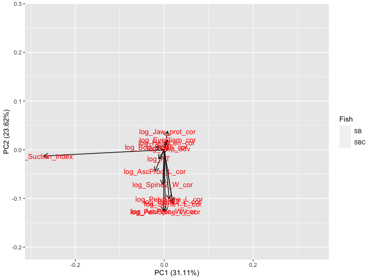

``` r
b <- b + geom_errorbar(data=gd, aes(ymin=lower_limit2, ymax=upper_limit2))+
    geom_errorbarh(data=gd, aes(xmin = lower_limit1,xmax = upper_limit1)) +
    geom_point(data=gd, aes(PC1, PC2, shape=Fish, color=Fish, size = Areaha)) + 
    theme_pubr() + geom_text(data = gd, aes(label=Lake)) +
    scale_color_manual(values=c( "#016450", "#67a9cf")) + 
    xlab(paste0("PC1 (",round((100*pve_cov[1]),2), "%)")) +
    ylab(paste0("PC2 (", round((100*pve_cov[2]),2), "%)"))

b
```

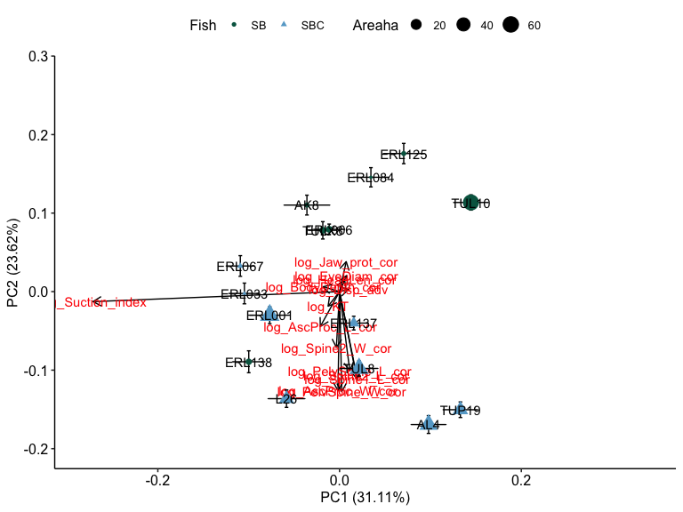

PC3 and PC4

``` r
b <-  autoplot(pca, x=3, y=4, data = Data, colour = 'Fish', fill ='Fish',
           loadings = TRUE, loadings.colour = 'black', shape = 'Fish', label = F,
           loadings.label = T, scale = 0.4, alpha=0, loadings.label.repel=F)
b  
```

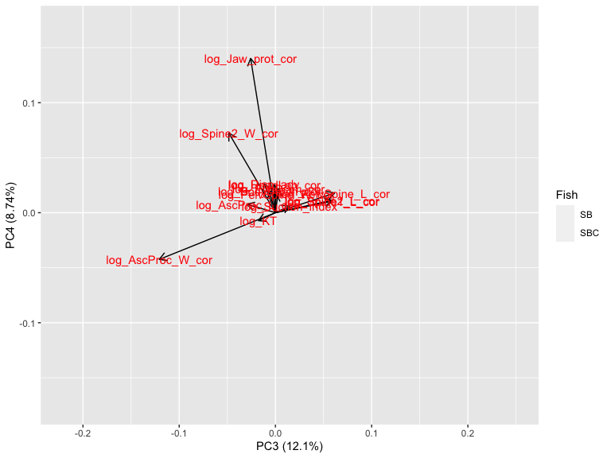

``` r
b <- b + geom_errorbar(data=gd, aes(ymin=lower_limit4, ymax=upper_limit4)) +
    geom_errorbarh(data=gd, aes(xmin = lower_limit3,xmax = upper_limit3)) +
    geom_point(data=gd, aes(PC3, PC4, shape=Fish, color=Fish, size = Areaha)) + theme_pubr() +
    geom_text(data = gd, aes(label=Lake)) +
    scale_color_manual(values=c( "#016450", "#67a9cf")) + 
    xlab(paste0("PC3 (", round((100*pve_cov[3]),2), "%)")) + 
    ylab(paste0("PC4 (", round((100*pve_cov[4]),2), "%)"))

b
```

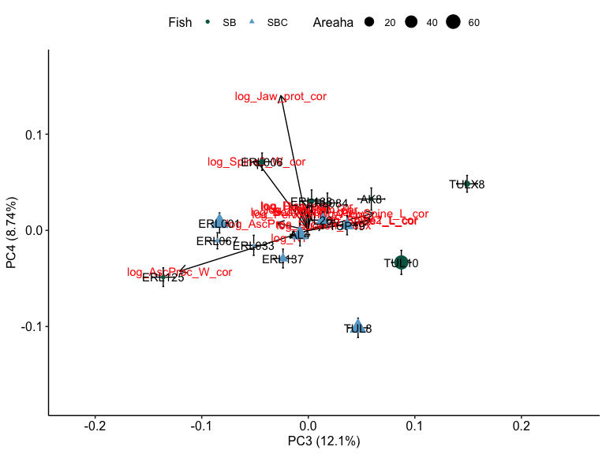

Plots without the loadings getting in the way.

``` r
b <- ggplot(data=gd, aes(PC1, PC2)) + 
    geom_errorbar(data=gd, aes(ymin=lower_limit2, ymax=upper_limit2)) +
    geom_errorbarh(data=gd, aes(xmin = lower_limit1,xmax = upper_limit1, height=0.01)) +
    geom_point(data=gd, aes(PC1, PC2, shape=Fish, color=Fish, size = Areaha)) + theme_pubr() +
    geom_text_repel(data = gd, aes(label=Lake)) +
    scale_color_manual(values=c( "#016450", "#67a9cf")) + 
    xlab(paste0("PC1 (", round((100*pve_cov[1]),2), "%)")) + 
    ylab(paste0("PC2 (", round((100*pve_cov[2]),2), "%)"))

b
```

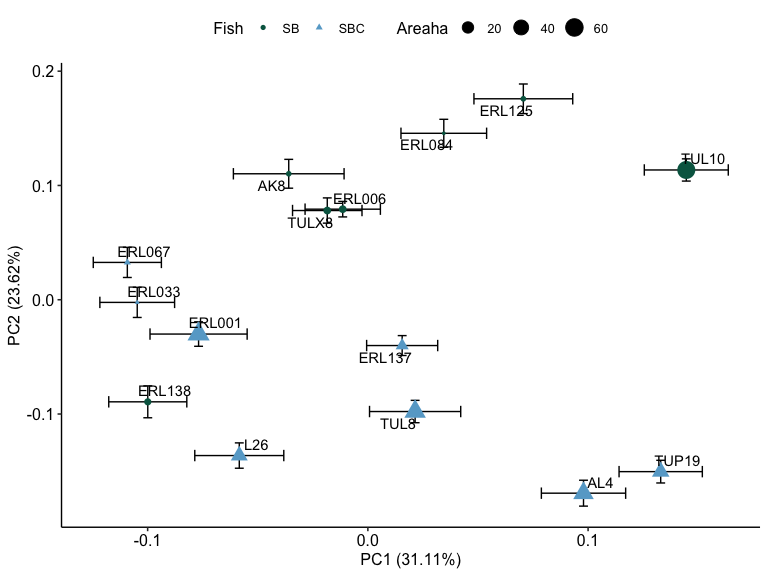

``` r
b <- ggplot(data=gd, aes(PC3, PC4)) + 
    geom_errorbar(data=gd, aes(ymin=lower_limit4, ymax=upper_limit4)) +
    geom_errorbarh(data=gd, aes(xmin = lower_limit3,xmax = upper_limit3)) +
    geom_point(data=gd, aes(PC3, PC4, shape=Fish, color=Fish, size = Areaha)) + theme_pubr() +
    geom_text(data = gd, aes(label=Lake)) +
    scale_color_manual(values=c( "#016450", "#67a9cf")) + 
    xlab(paste0("PC3 (", round((100*pve_cov[3]),2), "%)")) + 
    ylab(paste0("PC4 (", round((100*pve_cov[4]),2), "%)"))

b
```

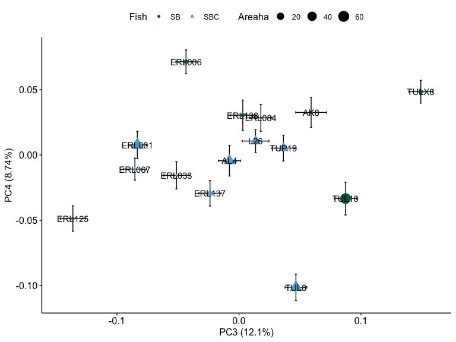

Test if there is significant multivariate phenotypic differences (PC scores) among lakes using MANCOVA.

``` r
model.full <- lm(cbind(PC1, PC2, PC3,PC4,PC5) ~ log_StLen + Fish + Areaha + 
                   log_StLen*Fish + log_StLen*Areaha + Areaha*Fish + 
                   log_StLen*Fish*Areaha, data=Data)
fit <- Manova(model.full, type="III", test.statistic="Wilks")
fit
```

    ## 
    ## Type III MANOVA Tests: Wilks test statistic
    ##                       Df test stat approx F num Df den Df    Pr(>F)    
    ## (Intercept)            1   0.95679   6.1058      5    676 1.525e-05 ***
    ## log_StLen              1   0.96227   5.3014      5    676 8.696e-05 ***
    ## Fish                   1   0.98083   2.6427      5    676 0.0223240 *  
    ## Areaha                 1   0.96653   4.6820      5    676 0.0003281 ***
    ## log_StLen:Fish         1   0.98228   2.4384      5    676 0.0333075 *  
    ## log_StLen:Areaha       1   0.96692   4.6249      5    676 0.0003706 ***
    ## Fish:Areaha            1   0.97735   3.1333      5    676 0.0083504 ** 
    ## log_StLen:Fish:Areaha  1   0.97613   3.3068      5    676 0.0058608 ** 
    ## ---
    ## Signif. codes:  0 '***' 0.001 '**' 0.01 '*' 0.05 '.' 0.1 ' ' 1

``` r
EtaSq <- etasq(model.full, test = "Wilks", anova = TRUE, partial = TRUE)
EtaSq
```

    ##                             eta^2
    ## log_StLen             0.021769524
    ## Fish                  0.415952800
    ## Areaha                0.226096048
    ## log_StLen:Fish        0.006896817
    ## log_StLen:Areaha      0.067952389
    ## Fish:Areaha           0.060355412
    ## log_StLen:Fish:Areaha 0.023874460

PCA with Marine fish to see relative trait divergence.

``` r
Data1 <- as.data.frame(na.omit(FinalTraits)) #PCA won't work with missing data, so we remove an individual where one of the functional systems could not be calculated from the photographs
pca1<-prcomp(Data1[,c(4:17)])
summary(pca1) # print variance accounted for by each axis
```

    ## Importance of components:
    ##                           PC1    PC2     PC3     PC4     PC5     PC6     PC7
    ## Standard deviation     0.1523 0.1387 0.09521 0.08050 0.07156 0.05701 0.05401
    ## Proportion of Variance 0.3041 0.2521 0.11887 0.08497 0.06715 0.04261 0.03825
    ## Cumulative Proportion  0.3041 0.5563 0.67513 0.76010 0.82726 0.86987 0.90812
    ##                            PC8     PC9    PC10    PC11    PC12    PC13    PC14
    ## Standard deviation     0.04671 0.03761 0.03512 0.03078 0.02281 0.02156 0.01564
    ## Proportion of Variance 0.02861 0.01854 0.01618 0.01242 0.00682 0.00610 0.00321
    ## Cumulative Proportion  0.93673 0.95527 0.97145 0.98388 0.99070 0.99679 1.00000

``` r
plot(pca1,type="lines") # scree plot
```


``` r
pr.cvar1 <- pca1$sdev ^ 2 # Calculate eigen value for each component
round(pr.cvar1, 2) # Eigen values 
```

    ##  [1] 0.02 0.02 0.01 0.01 0.01 0.00 0.00 0.00 0.00 0.00 0.00 0.00 0.00 0.00

``` r
mean(pr.cvar1)
```

    ## [1] 0.005447261

``` r
pve_cov1 <- pr.cvar1/sum(pr.cvar1) # Variance explained by each principal component: pve
pve_cov1
```

    ##  [1] 0.304151756 0.252107443 0.118872495 0.084972595 0.067153701 0.042611881
    ##  [7] 0.038248844 0.028611498 0.018543381 0.016177898 0.012424621 0.006820848
    ## [13] 0.006095528 0.003207513

``` r
scores1 <- pca1$x
scores1 <- data.frame(scores1)
Data1 <- cbind(Data1, scores1)
names(Data1)
```

    ##  [1] "Site"                "FishEc"              "log_StLen"          
    ##  [4] "log_BodyDepth_cor"   "log_HeadLen_cor"     "log_EyeDiam_cor"    
    ##  [7] "log_Jaw_prot_cor"    "log_Spine1_L_cor"    "log_Spine2_L_cor"   
    ## [10] "log_Spine2_W_cor"    "log_PelvSpine_L_cor" "log_PelvSpine_W_cor"
    ## [13] "log_AscProc_W_cor"   "log_AscProc_L_cor"   "log_Suction_index"  
    ## [16] "log_KT"              "log_Disp_adv"        "PC1"                
    ## [19] "PC2"                 "PC3"                 "PC4"                
    ## [22] "PC5"                 "PC6"                 "PC7"                
    ## [25] "PC8"                 "PC9"                 "PC10"               
    ## [28] "PC11"                "PC12"                "PC13"               
    ## [31] "PC14"

``` r
Data1   <- merge(LakeInfo, Data1, by.x = ("Lake"), by.y = ("Site"), all.y = TRUE)
colnames(Data1)[1] <- "Site"


gd1 <- Data1 %>% 
  dplyr::group_by(Site) %>% # Group the data by sample site
  dplyr::summarize(mean_Comp1=mean(PC1), # Create variable with mean of PC per group
            mean_Comp2=mean(PC2),
            mean_Comp3=mean(PC3),
            mean_Comp4=mean(PC4),
            sd_Comp.1=sd(PC1), # Create variable with sd of PC per group
            sd_Comp.2=sd(PC2),
            sd_Comp.3=sd(PC3),
            sd_Comp.4=sd(PC4),
            N_PC=n(), # Create new variable N of PC per group
            se1=sd_Comp.1/sqrt(N_PC), # Create variable with se of PC per group
            se2=sd_Comp.2/sqrt(N_PC), 
            se3=sd_Comp.3/sqrt(N_PC),
            se4=sd_Comp.4/sqrt(N_PC),
            upper_limit1=mean_Comp1+se1, # Upper limit
            lower_limit1=mean_Comp1-se1, # Lower limit
            upper_limit2=mean_Comp2+se2, # Upper limit
            lower_limit2=mean_Comp2-se2, # Lower limit
            upper_limit3=mean_Comp3+se3, # Upper limit
            lower_limit3=mean_Comp3-se3, # Lower limit
            upper_limit4=mean_Comp4+se4, # Upper limit
            lower_limit4=mean_Comp4-se4 # Lower limit
  ) 

gd1   <- merge(LakeInfo, gd1, by.x = ("Lake"), by.y = ("Site"), all.y = TRUE)
colnames(gd1)[5] <- "PC1"
colnames(gd1)[6] <- "PC2"
colnames(gd1)[7] <- "PC3"
colnames(gd1)[8] <- "PC4"


b <- ggplot(data=gd1, aes(PC1, PC2)) + 
    geom_errorbar(data=gd1, aes(ymin=lower_limit2, ymax=upper_limit2)) +
    geom_errorbarh(data=gd1, aes(xmin = lower_limit1,xmax = upper_limit1, height=0.01)) +
    geom_point(data=gd1, aes(PC1, PC2, shape=Fish, fill=Fish, size = 6), colour="black") + theme_pubr() +
    scale_shape_manual(values=c(22, 25, 24)) +
    scale_fill_manual(values=c("#67a9cf", "#016265","#01C8AC")) + 
    xlab(paste0("PC1 (", round((100*pve_cov1[1]),2), "%)")) + 
    ylab(paste0("PC2 (", round((100*pve_cov1[2]),2), "%)"))

b
```

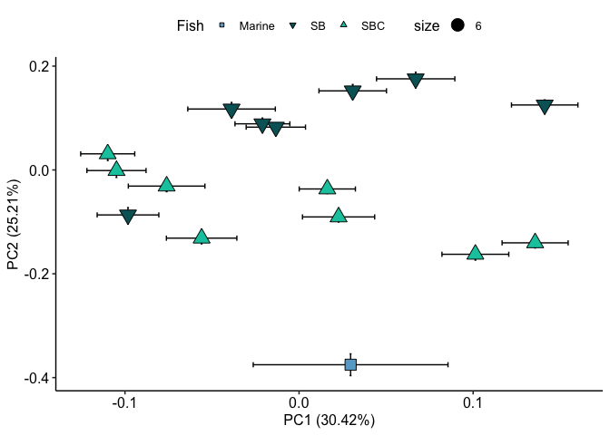

``` r
b <- ggplot(data=gd1, aes(PC1, PC2)) + 
    geom_errorbar(data=gd1, aes(ymin=lower_limit2, ymax=upper_limit2)) +
    geom_errorbarh(data=gd1, aes(xmin = lower_limit1,xmax = upper_limit1, height=0.01)) +
    geom_point(data=gd1, aes(PC1, PC2, shape=Fish, fill=Fish, size = Areaha), colour="black") + theme_pubr() +
    scale_shape_manual(values=c(22, 25, 24)) +
    scale_fill_manual(values=c("#67a9cf", "#016265","#01C8AC")) + 
    xlab(paste0("PC1 (", round((100*pve_cov1[1]),2), "%)")) + 
    ylab(paste0("PC2 (", round((100*pve_cov1[2]),2), "%)"))

b
```

    ## Warning: Removed 1 rows containing missing values (geom_point).

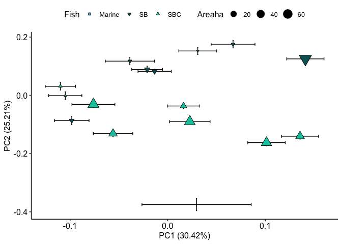

exploratory stuff

``` r
ggplot(data = Data, aes(x=Fish,y=log_PelvSpine_L_cor,fill=Site)) + geom_boxplot()+ theme_pubr() 
```

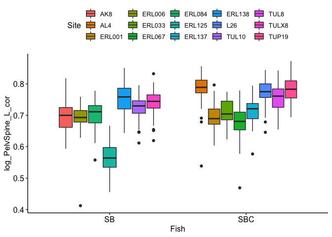

``` r
ggplot(data = Data, aes(x=reorder(Site,log_PelvSpine_L_cor),y=log_PelvSpine_L_cor,fill=Fish)) + geom_boxplot()+ theme_pubr() + 
  scale_fill_manual(values=c( "#016265", "#01C8AC", "#67a9cf","#fc8d59")) + facet_grid(.~Fish, scales = "free", space = "free") +
  theme(strip.background = element_blank(), strip.text.x = element_blank())
```

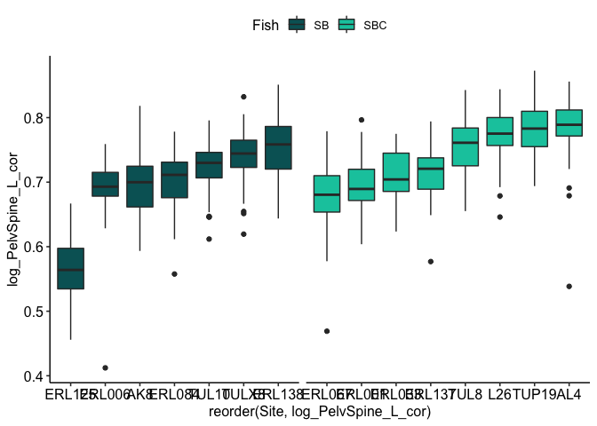
